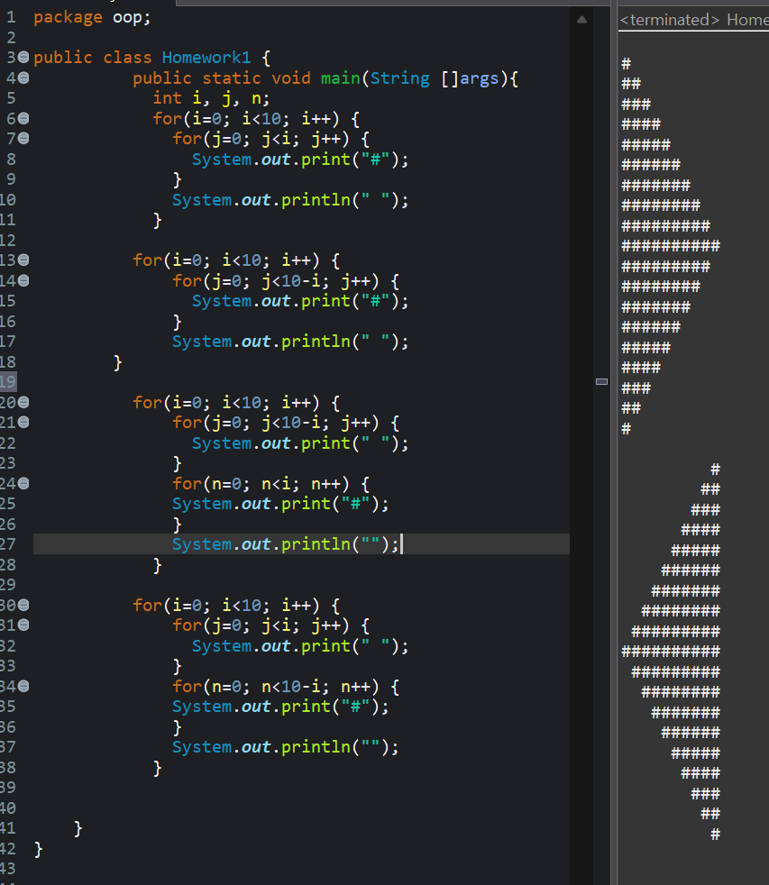
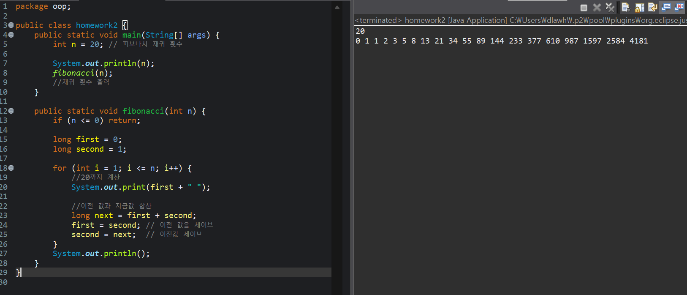
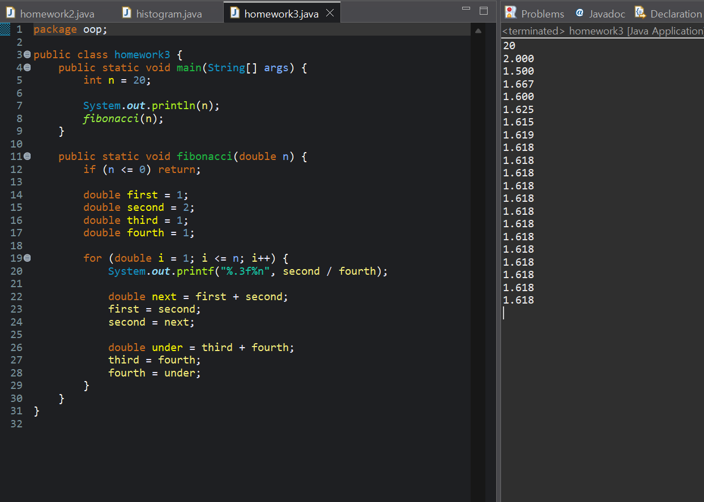

### homework1
```homework1

public class Homework1{
  public static void main(String []args){
    int i, j;
    for(i=0; i<10; i++) {
      for(j=0; j<10; j++) {
        System.out.print("#");
      }
      System.out.println("");
    }
  }
}
```


### homework2
```homework2

public class homework2 {
    public static void main(String[] args) {
        int n = 20; // 피보나치 횟수

        System.out.println(n);
        fibonacci(n);
        //피보나치 횟수 출력
    }

    public static void fibonacci(int n) {
        if (n <= 0) return;

        long first = 0;
        long second = 1;

        for (int i = 1; i <= n; i++) {
        	//20까지 계산
            System.out.print(first + " ");

            //이전 값과 지금값 합산
            long next = first + second;
            first = second; // 이전 값을 세이브
            second = next;  // 이전값 세이브
        }
        System.out.println();
    }
}
```


### homework3
```homework3
package oop;

public class homework3 {
    public static void main(String[] args) {
        int n = 20;

        System.out.println(n);
        fibonacci(n);
    }

    public static void fibonacci(double n) {
        if (n <= 0) return;

        double first = 1;
        double second = 2;
        double third = 1;
        double fourth = 1;

        for (double i = 1; i <= n; i++) {
            System.out.println(second / fourth);

            double next = first + second;
            first = second;
            second = next;
            
            double under = third + fourth;
            third = fourth;
            fourth = under;
        }
    }
}
```

