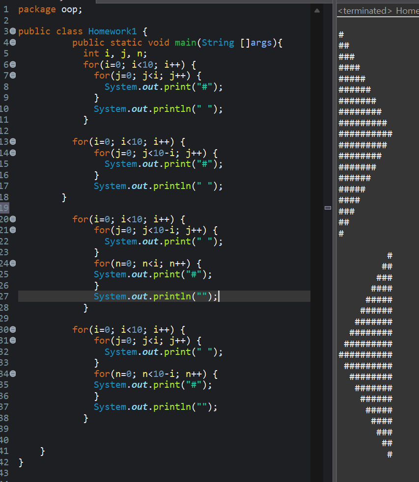
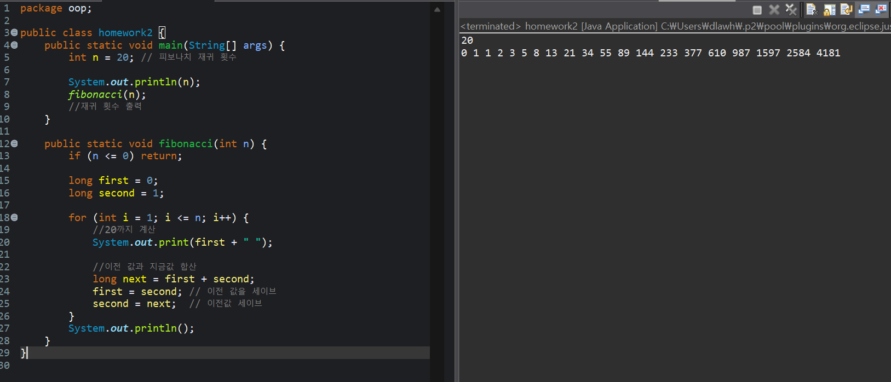
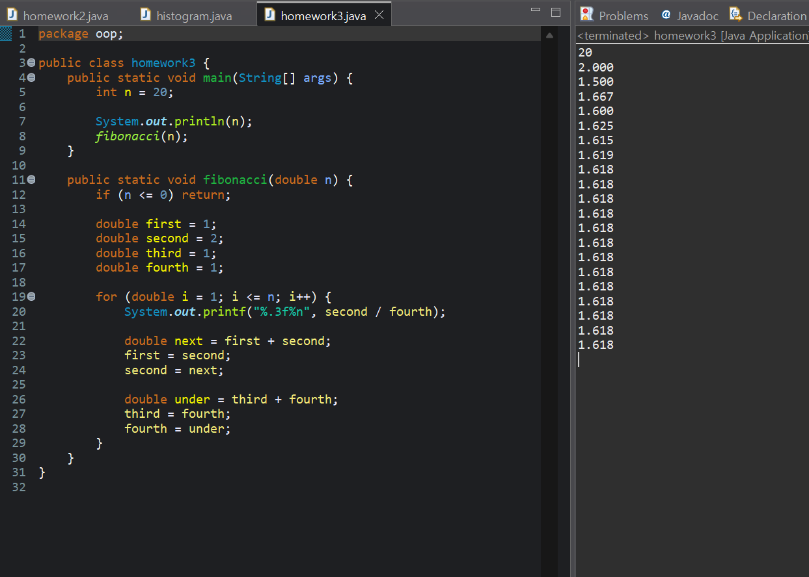
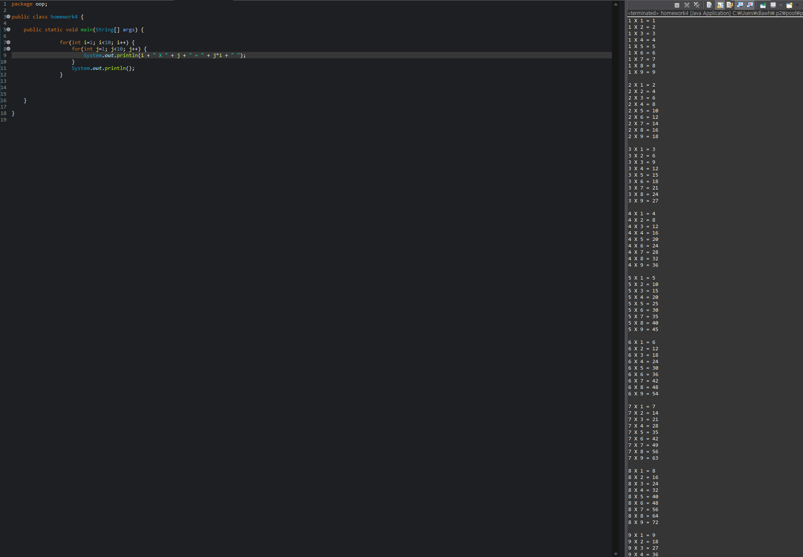
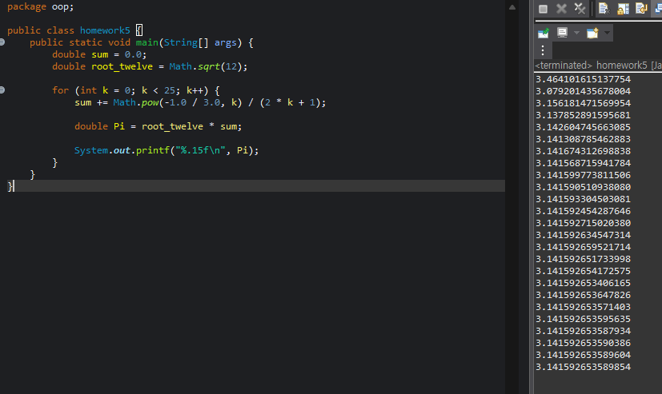
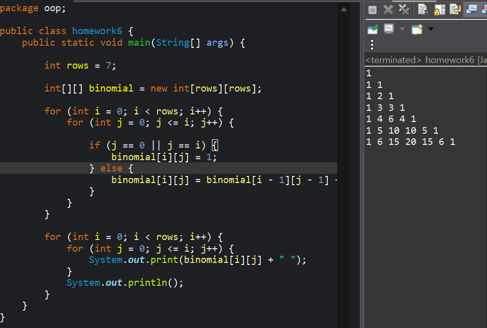
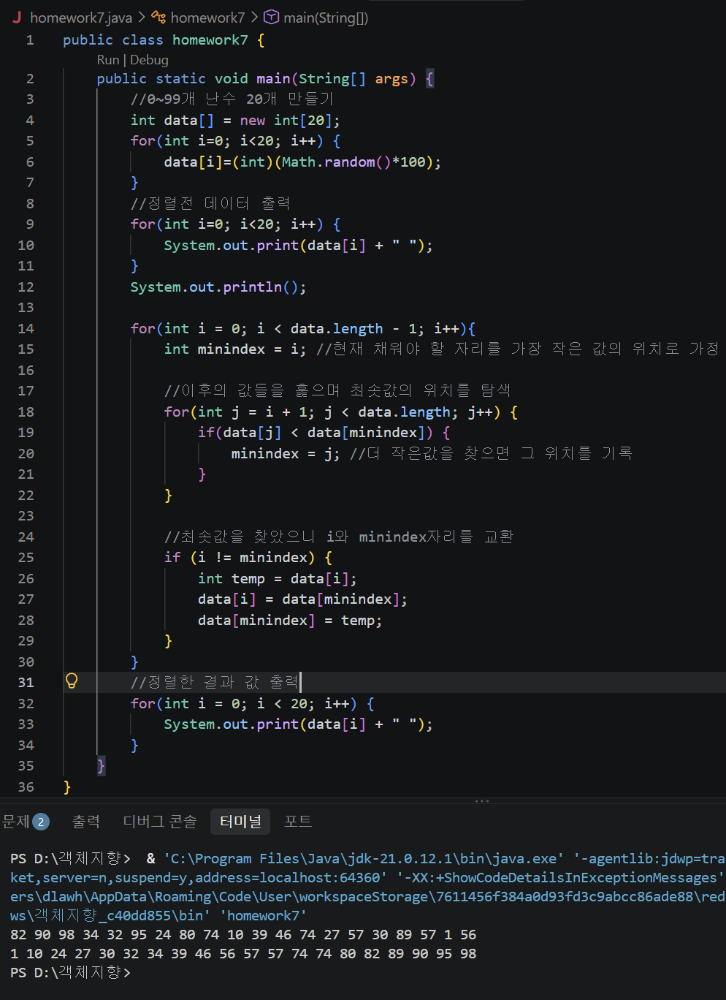

### homework1
```homework1

public class Homework1{
  public static void main(String []args){
    int i, j;
    for(i=0; i<10; i++) {
      for(j=0; j<10; j++) {
        System.out.print("#");
      }
      System.out.println("");
    }
  }
}
```


### homework2
```homework2

public class homework2 {
    public static void main(String[] args) {
        int n = 20; // 피보나치 횟수

        System.out.println(n);
        fibonacci(n);
        //피보나치 횟수 출력
    }

    public static void fibonacci(int n) {
        if (n <= 0) return;

        long first = 0;
        long second = 1;

        for (int i = 1; i <= n; i++) {
        	//20까지 계산
            System.out.print(first + " ");

            //이전 값과 지금값 합산
            long next = first + second;
            first = second; // 이전 값을 세이브
            second = next;  // 이전값 세이브
        }
        System.out.println();
    }
}
```


### homework3
```homework3
package oop;

public class homework3 {
    public static void main(String[] args) {
        int n = 20;

        System.out.println(n);
        fibonacci(n);
    }

    public static void fibonacci(double n) {
        if (n <= 0) return;

        double first = 1;
        double second = 2;
        double third = 1;
        double fourth = 1;

        for (double i = 1; i <= n; i++) {
            System.out.println(second / fourth);

            double next = first + second;
            first = second;
            second = next;
            
            double under = third + fourth;
            third = fourth;
            fourth = under;
        }
    }
}
```


### homework4
```
package oop;

public class homework4 {

	public static void main(String[] args) {
		
				for(int i=1; i<10; i++) {
					for(int j=1; j<10; j++) {
						System.out.println(i + " X " + j + " = " + j*i + " ");
					}
					System.out.println();
				}
			

		
	}

}

```

### homework5
```
package oop;

public class homework5 {
    public static void main(String[] args) {
        double sum = 0.0;
        double root_twelve = Math.sqrt(12);
        
        for (int k = 0; k < 25; k++) {
            sum += Math.pow(-1.0 / 3.0, k) / (2 * k + 1);
            
            double Pi = root_twelve * sum;

            System.out.printf("%.15f\n", Pi);
        }
    }
}
```

### homework6
```
package oop;

public class homework6 {
	public static void main(String[] args) {
        
        int rows = 7;
        
        int[][] binomial = new int[rows][rows];

        for (int i = 0; i < rows; i++) {
            for (int j = 0; j <= i; j++) {
            	
                if (j == 0 || j == i) {
                    binomial[i][j] = 1;
                } else {
                    binomial[i][j] = binomial[i - 1][j - 1] + binomial[i - 1][j];
                }
            }
        }

        for (int i = 0; i < rows; i++) {
            for (int j = 0; j <= i; j++) {
                System.out.print(binomial[i][j] + " ");
            }
            System.out.println();
        }
    }
}

```


###homework7
```
public class homework7 {
    public static void main(String[] args) {
        //0~99개 난수 20개 만들기
        int data[] = new int[20];
        for(int i=0; i<20; i++) {
            data[i]=(int)(Math.random()*100);
        }
        //정렬전 데이터 출력
        for(int i=0; i<20; i++) {
            System.out.print(data[i] + " ");
        }
        System.out.println();

        for(int i = 0; i < data.length - 1; i++){
            int minindex = i; //현재 채워야 할 자리를 가장 작은 값의 위치로 가정

            //이후의 값들을 훑으며 최솟값의 위치를 탐색
            for(int j = i + 1; j < data.length; j++) {
                if(data[j] < data[minindex]) {
                    minindex = j; //더 작은값을 찾으면 그 위치를 기록
                }
            }

            //최솟값을 찾았으니 i와 minindex자리를 교환
            if (i != minindex) {
                int temp = data[i];
                data[i] = data[minindex];
                data[minindex] = temp; 
            }
        }
        //정렬한 결과 값 출력
        for(int i = 0; i < 20; i++) {
            System.out.print(data[i] + " ");
        }
    }
}

```

